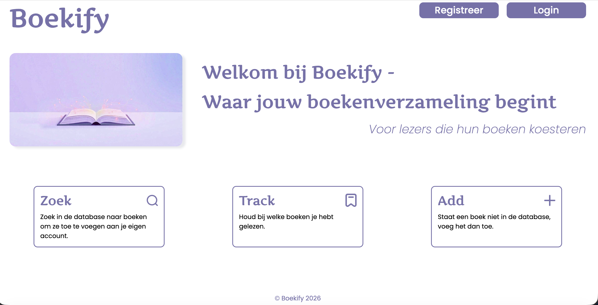

# Boekify

Boekify is een webapplicatie voor het bijhouden van je thuisbibliotheek en op dit moment meer om aan te geven welke boeken
je hebt gelezen. Op dit moment is de webapplicatie nog in ontwikkeling en zullen er ter zijner tijd functies toegevoegd 
worden.

## Inhoud
- Screenshot
- Benodigde en gebruikte technieken en frameworks
- Configuratie handleiding
- Inloggegevens
- Beschikbare NPM commando's


## Screenshot



## Benodigde en gebruikte technieken en frameworks

### Frameworks & building tools
Voor het bouwen van deze applicatie is gebruik gemaakt van React. Zo wordt er gebruik gemaakt van componenten, hooks,
React DOM voor het renderen in de browser, Vite 7 voor de dev-server, @vitejs/plugin-react voor de React-ondersteuning 
in Vite en ESLint voor de codekwaliteit/linting

### Routing & navigatie
Hiervoor is gebruik gemaakt van React Router DOM v7 voor de routing (`BrowserRouter`, `Routes`, `Route`).
Verder wordt er gebruik gemaakt van:
- `useParams` voor de dynamische routes. 
- `Navigate` voor het doorsturen bij login/logout.
- `UseNavigate` voor het programmatisch navigeren.
- `NavLink` voor navigatie met actieve link-styling.
- `UseLocation/location.state` voor het doorgeven van data tussen pagina's.
- `Link` voor links naar bijv. boekdetails.

### Data & Backend
Er wordt gebruik gemaakt van de NOVI Backend API. Hier staat alle data op, middels een `data.json` file. Voor de API request
is er een novi-education-project-id nodig. Deze is toegevoegd in de project-header.
De data wordt opgehaald middels `axios`.

### Authenticatie & autorisatie
Er wordt ingelogd met behulp van React Context (AuthContext). Hierbij wordt een token aangemaakt, en deze wordt uitgelezen 
met jwt-decode. Er is een `isTokenValid` helper om te controleren of de token niet verlopen is. 
Verder wordt er gebruik gemaakt van Bearer Authorization voor beveiligde requests en zijn er protected routes.

### Technieken
Deze applicatie maakt gebruik van componenten.  
Daarnaast worden er hooks als `useState`, `useEffect` en `useContext` gebruikt voor bijv. formulieren, lijsten, sorteren, 
data ophalen en de navigatie.  
Het inloggen, registreren, het toevoegen van een boek of review en het zoekveld zijn middels controlled forms gemaakt.  
De API-calls gaan middels async/await.  
Verder is er gebruik gemaakt van lifted state/props (bijv. rating parent <-> child), conditional rendering, `.map()` voor 
het gebruik van lijsten als boeken, reviews, gelezen boeken en kan de gebruiker de bibliotheeklijst 
sorteren/filteren op titel, auteur en genre.

### Styling & assets
Er is voornamelijk gebruik gemaakt van gewonen CSS. De pagina's zijn middels flexbox gepositioneerd. Deels is er gebruik 
gemaakt van CSS modules (bij de knoppen). Ook is er gebruik gemaakt van CSS-variabelen, met name bij de kleuren.  
In de assets folder zijn afbeeldingen, boekcovers en iconen geplaatst.  
Er is gebruik gemaakt van react-icons voor de rating (`FaHeart`)  

### Overig
Dependency beheer is middels npm/package-lock.json.  
ES modules  
Git  

## Configuratie Handleiding
Om dit project lokaal draaiende te krijgen zul je dit project moeten clonen middels GitHub.  
Installeer dan vervolgens de dependencies. In WebStorm wordt dit automatisch aangegeven met een popup `run npm install`.
Of type in de terminal: 
```javascript
npm install
```
Is de installatie klaar, dan kun je de applicatie starten met:
```javascript
npm run dev
```
Open http://localhost:5173/ om de pagina in de browser te bekijken.

## Inloggegevens
Je kunt er voor kiezen om je te registeren. De functies werken (op de 'op dit moment aan het lezen' lijst na). Wil je deze
lijst ook in actie zien. Dan kun je inloggen met:
```javascript
tessavermeulen@icloud.com
admin123
```
## Overige npm commando's die beschikbaar zijn:
```javascript
npm run build
```
Deze maakt de applicatie klaar voor productie zodat het geupload kan worden naar de hostingserver.

```javascript
npm run preview
```
Hiermee kan je de gebouwde app lokaal bekijken. Dit commando verwacht wel dat je eerst `npm run build` hebt gedraaid. Op
deze manier kan je controleren of alles in productiemodus goed werkt.

```javascript
npm run lint
```
Hiermee kun je de code controleren op fouten en stijlregels, zonder dat de app gedraaid wordt.